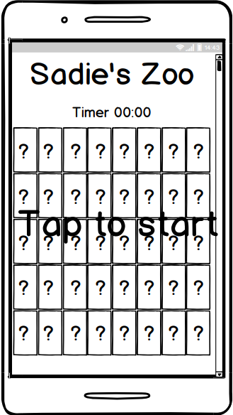
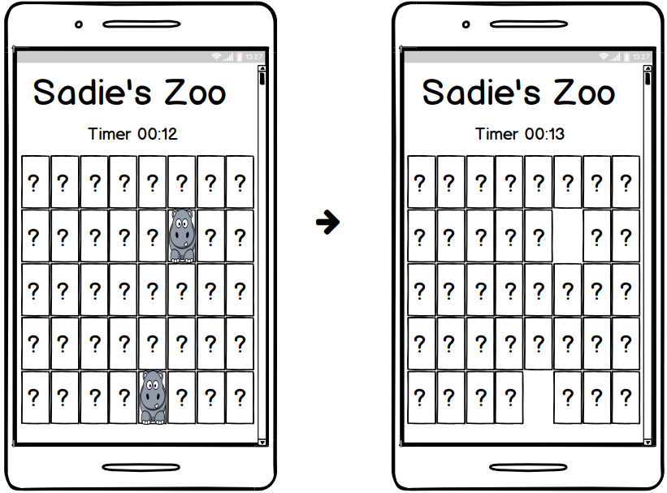
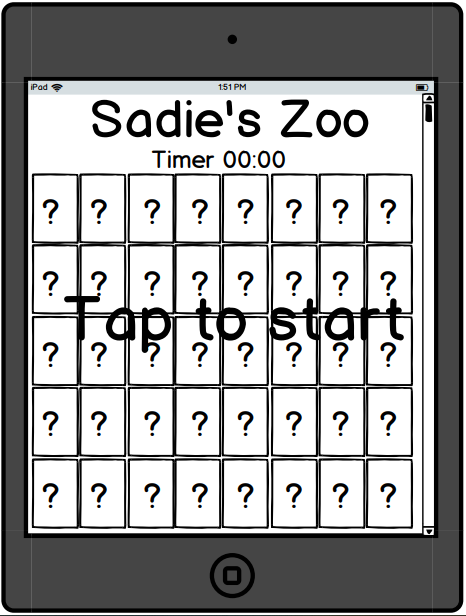
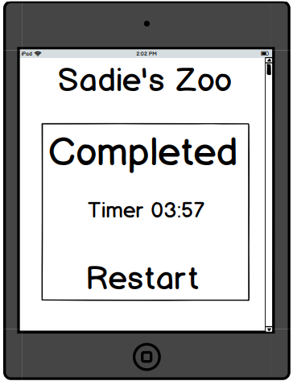
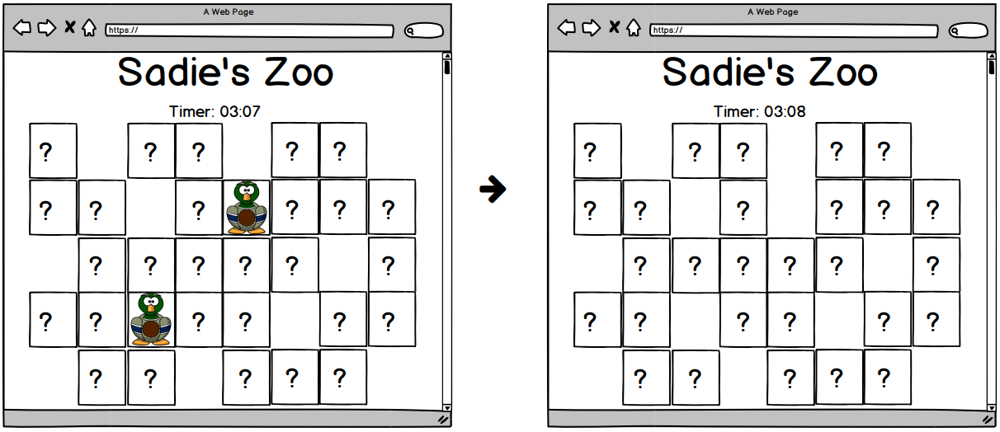

# My Second Project: Sadie’s Farm
This project is about creating a card matching game using cartoon pictures of zoo animals. The aim of the game is to entertain users who are looking for an activity to participate in for the sake of passing time by. The game is played by the user clicking or tapping on the cards in order to flip them. All the cards have the same image of a question mark on them. Once one card is flipped, a zoo animal will show. The user is to find the other card that has the same zoo animal displayed. If successful, the cards will disappear. If not, the cards will flip back. The game is won once the user has successfully found all the zoo animal paired cards.

# UX
- This game is for any user who wants to play a game for fun or to help time pass by.
- This game will provide the users information on how long they spent trying to find the matching animal cards, on completion.
- Users who play this game will want to find the matching cards in the shortest amount of time possible and will repeat the game to do so.

# User Stories 
- As a user of the Sadie’s Farm card matching game, I want to be able to understand how to play the game quickly. 
- As a user of the Sadie’s Farm card matching game, I want to see how long I took to match all the cards. 
- As a user of the Sadie’s Farm card matching game, I want the card’s order to change after every attempt to keep the game challenging. 

# Designer Goals
- As the designer of the Sadie’s Farm card matching game, I want to make a simple layout that will help the user easily guide themself through the game.
- As the designer of the Sadie’s Farm card matching game, I want to create a popup that displays how long the user took in completing the game, after each try.
- As the designer of the Sadie’s Farm card matching game, I want to implement a functionality that makes the cards shuffle after each game play, so the user remains interested in the game.

# Sadie’s Farm Wireframes

# Technologies Used
## HTML
- The project used HTML to create the basic structure of the game.
## CSS
- The project used CSS to add the design to the basic HTML structure.
## JavaScript
- The project used JavaScript to add functionality to the game.
## jQuery
- The project used jQuery to speed up the process of adding functionality to the game.
## Chrome Development Tools
- The project used Chrome Development Tools to see how the game looked on different screen sizes and to help identify areas of the code that required editing.
## Balsamiq Wireframes
- The project used Balsamiq Wireframes to create mockups on how the game aimed to look across different sized devices, to the user, on completion.
## Markup Validation Service
- The project used W3C Markup Validation Service to help check for coding errors that required correction in the HTML page.
## CSS Validation Service
- The project used W3C CSS Validation Service to help check for coding errors that required correction in the CSS page.
## Gitpod
- The project used Gitpod to write out the HTML and CSS code in its editor, as well as the README file. It also stored the images used and the wireframes. In addition, it was used to check the status of, add, commit and push the coded work to GitHub.
## GitHub
- The project used GitHub to store and save coded work from Gitpod as repositories. It was also used to deploy the website.
## Free SVG
- The project used Free SVG to provide free to use images for the animals and the question mark.
## Clipart-Library
- The project used Clipart-Library to provide free to use images for the animals.
## Snipping Tool
- The project used Snipping Tool to edit out the wireframes for this project.
## Google Fonts
- The project used Google Font to provide the font style used for this project.

# URL Links
The following links, from the third party websites, were used to create this project:
## Free SVG
- Mallard
  * https://freesvg.org/14thwarrior-cartoon-mallard
- Owl
  * https://freesvg.org/lemmling-cartoon-owl
- Peafowl
  * https://freesvg.org/studiofibonacci-cartoon-peacock
- Question mark
  * https://freesvg.org/vector-image-of-primary-question-mark-black-and-white-icon
## Clipart-Library
- Elephant
  * http://clipart-library.com/clipart/pkT8ERRir.htm
- Giraffe
  * http://clipart-library.com/clipart/p6iyk8bcn.htm
- Zebra
  * http://clipart-library.com/clipart/8cEjyrkKi.htm
## Google Fonts
- https://fonts.google.com/specimen/Heebo?query=heebo&selection.family=Heebo
## jQuery
- https://jquery.com/download/

# Deployment 
On completion in creating this project, the following procedures were taken in order to deploy the website:
1) First, the repository section on GitHub was entered and the project link containing the website and wireframes to be deployed, was clicked on.
2) Then, the settings tab underneath the “Milestone-Project-2” heading, was clicked on to enter its settings.
3) Next, the settings page was then scrolled down until the sub-title “GitHub Pages” was found.
4) Later, under “GitHub Pages” a sub-title called “Source” was located. Under the “Source” sub-title was a button labelled “None”. This “None” button was clicked on to reveal a dropdown menu.
5) In the dropdown menu the option called “master branch” was selected.
6) After selecting the “master branch”, the webpage refreshed automatically and deployed the website.
7) Finally, the link to this newly deployed website, was taken from the “GitHub Pages” section.

# Running the code locally
In order to locally run this code, this project would have to be cloned from GitHub using the following steps:
1) First enter the list of repositories section of GitHub.
2) Then, under the repository name of the project, click on the “Clone or download” button.
3) Next, when in the dropdown “Clone with HTTPS” section click the clipboard button next to the URL to copy the repository's clone URL.
4) Afterwards, enter into the local IDE and open Git Bash.
5) Then, change the current working directory into the location of where the cloned directory is to be made.
6) Next, type in “git clone” and paste in the URL that was copied earlier from the “Clone with HTTPS” section i.e.: 
   * git clone: https://github.com/VioletViolaVi/Milestone-Project-2.git
7) Lastly, tap the enter button on the keyboard to create the local clone.

# Credits

## Content
- The responsive breakpoints used were recommended by Bootstrap.

## Media
- The images used on this website were taken from Free SVG and Clipart-Library.

## Acknowledgements
- I received inspiration for this project from the BrandedBrothers card matching game.
  - www.brandedbrothers.com